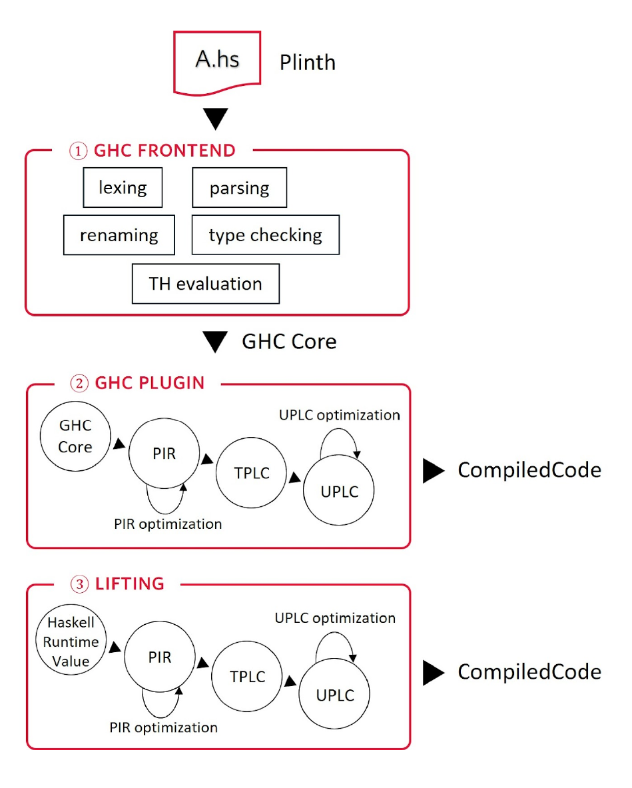

# The Scripting layer (Plutus)

Thanks to the "Scripting" layer (also refered as "Plutus"), we get to have smart contracts in Cardano. In this lesson, we'll talk not only about this layer but also about other technologies that are not part of the node but are tightly coupled to it.

## Introduction

Let's start by introducing the Plutus family members:

- **Untyped Plutus Core (UPLC)**: Also known simply as **Plutus Core** or **Plutus**, is a low-level, Turing-complete language based on untyped lambda calculus. It is the code that runs on-chain, i.e., by every node validating the transaction, using an interpreter known as the CEK machine. A UPLC program included in a Cardano transaction is often referred to as a Plutus script or a Plutus validator.
- **Typed Plutus Core (TPLC)**: Typed Plutus Core (TPLC) is the intrinsically typed counterpart of UPLC. It is based on higher-order polymorphic lambda calculus with isorecursive types (System Fωμ). TPLC serves as a low-level intermediate representation (IR) for the Plinth compiler. TPLC is closely related to UPLC, and compiling TPLC into UPLC is simply a matter of erasing types.
- **Plutus Intermediate Representation (PIR)**: Plutus IR (PIR) is a high-level IR also used by the Plinth compiler. It extends TPLC by adding recursive bindings and recursive data types. The fact that recursion is explicit in PIR, rather than encoded using fixed point operators as in TPLC and UPLC, makes PIR significantly more readable than TPLC and UPLC. When optimizing the cost or size of Plutus scripts written in Plinth, it is usually useful to look into PIR.

> NOTE: If you're wondering where does Aiken fit in here, Aiken is another high-level language that targets UPLC but with its own compiler. So, it would be an alternative to Plinth.

Since this lecture is about the nodes' scripting layer, I wouldn't blame you if you'd think we should be talking only about UPLC. Howerver, it's hard to talk about only UPLC since both the design and implementation of these languages are tightly coupled by Plinth's compilation pipeline. 

To help explain how these languages relate to each other, Plinth's compilation pipeline is shown in the figure below:

In broad terms, the compilation pipeline is as follows:
1. The developer writes a validator using Plinth (a subset of Haskell).
2. Haskell's GHC compiler translates the Plinth (Haskell) code to GHC Core and gives it to our custom GHC plugin.
3. Our GHC Plugin takes the GHC Core representation of the smart contract and translates it into Plutus Intermediate Representation (PIR).
4. Several optimizations are applied to PIR and, through a series of transformations, the compiler turns PIR into (typed) Plutus Core (PLC). The main difference between PIR and PLC is that the former has support for datatypes and recursion, and the latter does not.
5. The compiler erase's PLC's types to turn it into Untyped Plutus Core (UPLC).
6. As a last step, the compiler does some final optimizations directly to the Untyped Plutus Core (UPLC) representation.

Now that we have a rough idea of how the compiler works and the properties of each language, let's explore the Design Philosophy and Requirements that brought us here.

#### Design Philosophy and Requirements

UPLC was designed with several key requirements in mind:

- **Conservatism**: Given that UPLC will be involved in transaction validation and must support old transactions forever, it will be very hard to change. So, the design prioritizes tried-and-tested approaches over innovation. This also makes it easier to formalize, since we can build on existing work.

- **Minimalism**: UPLC is intentionally small and simple to minimize potential issues and make formal reasoning easier. While this may increase complexity in compilers that target UPLC, it's much easier to change the compilers than the scripting language itself.

- **Safety**: Since scripts are immutable once submitted to the blockchain, the design prioritizes certainty about what code will do to prevent value loss or theft.

- **Formalization**: One part of reasoning about what UPLC does is to formalize its semantics, so we can be sure that it both has a sensible semantics, and that the implementation agrees with that semantics.

- **Size Efficiency**: Since users will pay for the size of transactions and transaction size has a major effect on the throughput of the system, the representation of UPLC on the chain must not be too large.

- **Extensibility**: The language needs to be configurable for different ledgers that may support different basic primitives. For example, privacy-preserving ledgers may restrict the kinds of computation that can be done, which may mean we only have some kinds of arithmetic operations.

- **Multiple source languages**: It would be nice if multiple source languages could be compiled to our scripting language. This would potentially encourage usage by developers who are more comfortable with one or the other of the source languages.

#### Language Design

Here are *some* (non-exhaustive) design choices made by the Plutus Core team based on the design philosophy and requirements:

- **Lambda calculus based**: UPLC is based on the untyped lambda calculus, which is a simple and well-understood foundation for functional programming languages. This choice aligns with the goal of minimalism and formalization.

- **No primitive datatypes**: Instead of built-in datatypes and case expressions, datatypes are encoded by the compiler.

- **Strict evaluation**: UPLC is strict rather than lazy by default.

- **Isorecursive types**: Chosen over equirecursive types for simpler metatheory, with complexity handled by the compiler.

- **No direct recursive values**: While Typed Plutus Core supports recursive types, recursive values are encoded using fixpoint combinators.

- **Builtin Types**: Even though Plutus Core doesn't have a type system like you might be used to, it does have a set of builtin types. It uses a universe-based approach where constants are tagged with type information. This allows different universes for different contexts (e.g., testing vs. production).

- **Builtin Functions**: Implemented as runtime-indexed functions by name. Builtin functions can only accept arguments of builtin types (with exceptions for polymorphic functions) and are always saturated (applied to all arguments).

To avoid this lecture getting too long, we'll leve it here. However, if you're interested in knowing more, there are links to the language specification and other related documentation in the references below.

To summarize, the specification of Plutus Core can be described as: 

***System Fωμ* (the polymorphic lambda calculus with recursive types and higher-kinded types) with appropiate primitive types an operations**.

## Advantages of using Haskell to implement the Scripting layer

Now that we're familiar with what is going on in the settlement layer and all the technology developed around it, lets explore how Haskell helped develop them.

- **The language to develop languages**: Haskell offers a combination of features - Generalised Algebraic Data Types (GADTs), purity, higher order functions and parametric polymorphism - to name a few, that make it **particularly well-suited for programming language development**. Haskell is widely considered ideal for building embedded domain-specific languages (eDSLs) thanks to its powerful program manipulation capabilities.

- **Program optimizations with minimal boilerplate**: Its purity, polymorphism, and referential transparency make it easier to reason about code and **allow implementing program optimizations elegantly with minimal boilerplate**. 

- **Familiar Syntax**: Haskell enables an unconventional but powerful approach that we leverage to develop the Plinth language: Rather than being a typical eDSL, **Plinth is a subset of Haskell itself**. Users write ordinary Haskell code using the standard syntax, and compilation happens at the Haskell program’s compile time, **via a GHC Core plugin**. Plinth lets users avoid unfamiliar and heavyweight syntactic constructs that aren’t found in regular Haskell, and that are specifically designed to work with each individual eDSL.

- **Avoid implementing tooling for eDSL:**Compared to building a new language, **Plinth is significantly easier to implement**. It allows us to reuse not only components of GHC’s frontend - like lexer, parser, typechecker, de-sugarer - but also Haskell’s build tool (Cabal), debugger, testing frameworks, and meta-programming machinery. Each of these could be a substantial task for developers of a new language.

- **Leveraging AI**: The rise of AI tooling further strengthens these advantages. LLMs are reasonably effective at **generating and explaining simple Haskell code**, while **they struggle significantly more with bespoke eDSLs or niche languages** due to the lack of training data. In general, we believe AI will have an outsized benefit and amplify the strengths of technologies that have strong merits, but are perceived as hard to learn - Haskell being a prime example. 

- **Compilation pipeline**: The architecture of the compilation pipelined (described in the previous section) is only feasible because of **Haskell’s modular compiler and the powerful API for writing compiler plugins**.

- **GHC Core maps naturally with UPLC**: Another advantage of Haskell to Plutus Core is that GHC Core - GHC's compact, expressive lambda-calculus based intermediate language - **maps naturally to our on-chain language, Untyped Plutus Core (UPLC)**, itself a variant of the untyped lambda calculus. 

- **Good alignment with formal verification**: Haskell aligns well with our formal verification goals. Our certified compiler framework uses Agda to verify compiler transformations, and **Haskell’s interoperability with Agda allows seamless integration between the compiler and the certifier**. 

## References

- [Plutus Core Specification](https://plutus.cardano.intersectmbo.org/resources/plutus-core-spec.pdf)
- [Plinth User Guide](https://plutus.cardano.intersectmbo.org/docs/)
- [Plutus Report](https://plutus.cardano.intersectmbo.org/resources/plutus-report.pdf)
- [The Plutus Compilation Pipeline: Understanding Plutus Core(s)](https://well-typed.com/blog/2022/08/plutus-cores/)